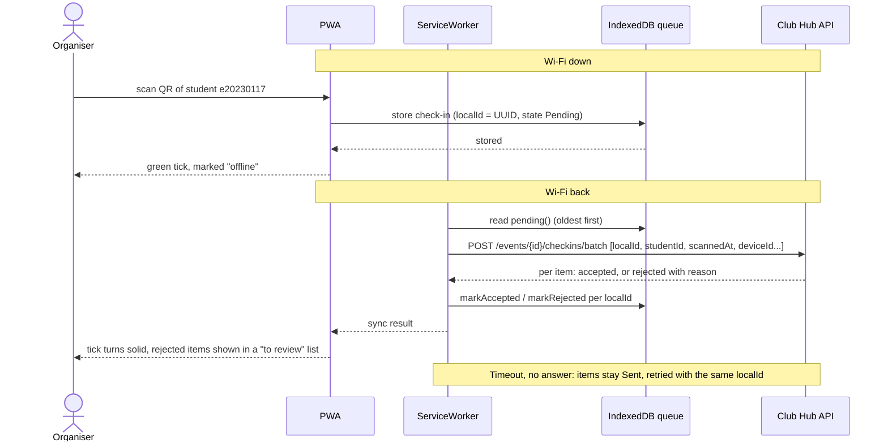

# Challege: offline-first check-in for the Club Hub PWA

## 1. Sequence diagram

```mermaid
sequenceDiagram
    actor Organiser
    participant PWA
    participant SW as ServiceWorker
    participant DB as IndexedDB queue
    participant API as Club Hub API

    Note over PWA,API: Wi-Fi down
    Organiser->>PWA: scan QR of student e20230117
    PWA->>DB: store check-in (localId = UUID, state Pending)
    DB-->>PWA: stored
    PWA-->>Organiser: green tick, marked "offline"
    Note over PWA,API: Wi-Fi back
    SW->>DB: read pending() (oldest first)
    SW->>API: POST /events/{id}/checkins/batch [localId, studentId, scannedAt, deviceId...]
    API-->>SW: per item: accepted, or rejected with reason
    SW->>DB: markAccepted / markRejected per localId
    SW-->>PWA: sync result
    PWA-->>Organiser: tick turns solid, rejected items shown in a "to review" list
    Note over SW,API: Timeout, no answer: items stay Sent, retried with the same localId
```
